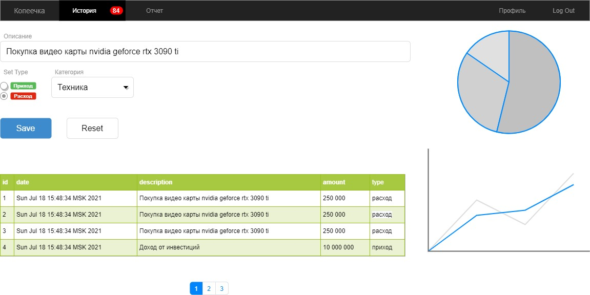

# ok-202105-finrec-ib

#Система отслеживания эффективности инвестиций

- возможность хранения актуального состояния
  - текущая рыночная стоимость активов
  - изменение стоимости активов за период
- истории изменения портфеля
  - покупка/продажа активов
- возможность получения отчетов по изменениям
- График капитала
- Возможность тегирования активов в различные портфели
- Просмотр состава портфеля

### Макет главной

## Управление сделками (trades)

CRUD для управления активами
- id
- symbolId (берется из справочника)
- цена сделки
- объем
- сумма сделки
- дата сделки
- платформа на которой была совершена сделка platformId
- флаг покупка/продажа Boolean
- portfolioIds (manyToMany)